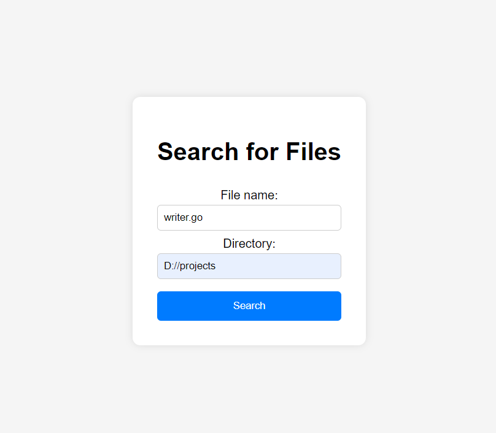

# File searcher

This is a simple Go application that allows users to search for files in a specified directory. The application run as web application or as a command-line tool.


*The user-friendly HTML form where you input your search criteria.*


*Displays the search results after the user submits the form.*

## Features

- **Web Interface:**
  - User-friendly HTML form for input.
  - Displays search results on a separate results page.
  
- **Command-Line Interface (CLI):**
  - Search for files or directories directly from the terminal.
  - Supports exact name matching.


## Setup and Running

1. **Clone the repository:**
    ```sh
   git clone https://github.com/Vkanhan/filesearcher.git
   cd filesearcher
   ```

2. **Running as a Web Application:**
    ```go
    go run main.go
    ```

    **Access the application:**
    Open your web browser and go to http://localhost:8080 to access the search form.

3. **Running as a Command-Line Tool:**
    ```go
    go run main.go -cli
    ```
    **Example CLI usage**
    ```$ go run main.go -cli
    Enter the file name to search for: search_result.png
    Enter the directory to search in: D://
    Matches found:
    D:\Projects\filesearcher\assets\search_result.png
    ```
4. **Command-Line Flags**
  
    **-cli:** Enables CLI mode.

    **-filename:** (optional) Specifies the file name to search for directly via the command line.

    **-directory:** (optional) Specifies the directory to search in directly via the command line.

## Usage 

**Web application**

  1. Open the application in your web browser at http://localhost:8080.

  2. Enter the file name and a valid directory path in the search form.

  3. Submit the form to view the search results.

**CLI application**

  1. Run the application with the -cli flag.

  2. Enter the file name and directory when prompted.

  3. The application will display any matches found.


## Note
Ensure that the directory path provided in the search form is an absolute path and has the necessary read permissions.

## License
This project is licensed under the GNU [LICENSE](LICENSE). See the LICENSE file for details.


